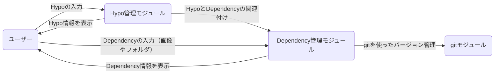

# SkimmedMilk

追加情報をありがとうございます。それでは、ご説明いただいた内容を元に、モジュール構成とデータの流れをまとめたmermaid記法での図示を作成します。

この図では、以下のようなデータの流れが示されています。

1. ユーザーがHypoの入力を行い、Hypo管理モジュールがそれを受け取ります。
2. ユーザーがDependencyの入力（画像やフォルダ）を行い、Dependency管理モジュールがそれを受け取ります。
3. Hypo管理モジュールがHypoとDependencyの関連付けを行い、Dependency管理モジュールに情報を渡します。
4. Dependency管理モジュールがgitモジュールを使ってバージョン管理を行います。
5. Dependency管理モジュールとHypo管理モジュールがそれぞれの情報をユーザーに表示します。

この図がアプリの概要とモジュール構成、モジュール間のデータの流れを正確に表しているかどうか、ご確認いただけますか？ 何か修正が必要な点があればお知らせください。
