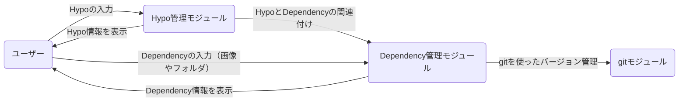

# SkimmedMilk

```mermaid
graph LR
A(ユーザー) -- Hypoの入力 --> B(Hypo管理モジュール)
B -- HypoとDependencyの関連付け --> C(Dependency管理モジュール)
A -- Dependencyの入力（画像やフォルダ） --> C
C -- gitを使ったバージョン管理 --> D(gitモジュール)
C -- Dependency情報を表示 --> A
B -- Hypo情報を表示 --> A
```
